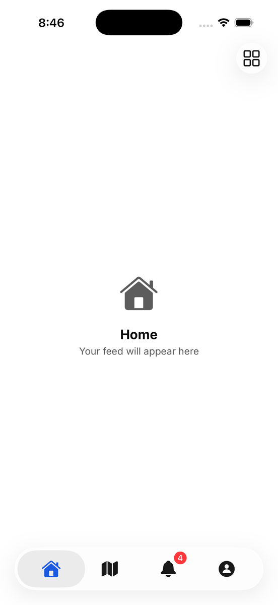
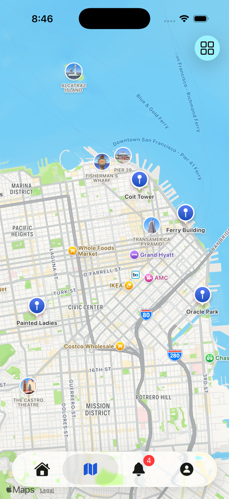
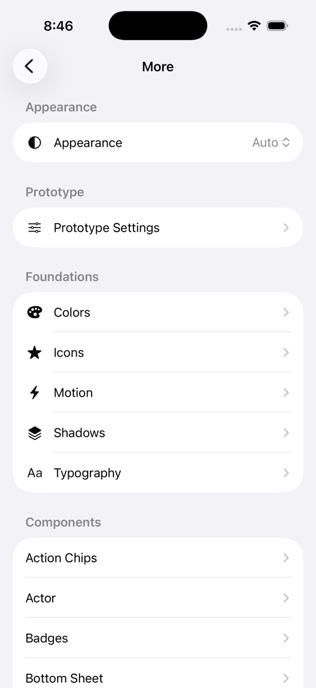

# Prism

Prism is a SwiftUI design system prototype. It pairs a complete token layer with a library of 35 components, all browsable inside the app through a built-in gallery, and demonstrates them in context with a small social app shell: a home feed, a map, an activity feed, and a profile.

| Home | Explore | Components |
|---|---|---|
|  |  |  |

## What's inside

**Foundations.** Semantic, appearance-aware tokens for color, typography, spacing, corner radius, icon size, elevation, and motion. Colors are built as raw scales with a semantic layer on top, so light and dark mode come for free. Typography is anchored to the system text styles and scales with Dynamic Type.

**Components.** 35 `PDS` components, from primitives (buttons, chips, badges, avatars, text fields) through composites (post cards, notification cells, profile headers, maps, bottom sheets, toasts, skeletons). Each ships with VoiceOver labels and traits, both appearances, and an entry in the gallery showing its variants and states.

**The gallery.** Launch the app and tap the grid button in the top right. Every token and component is showcased there, with an appearance switcher for checking light and dark. Prototype Settings holds AppStorage-backed toggles for customizing individual views.

## Requirements

- Xcode 26 or later
- iOS 18.5 or later

## Getting started

```bash
git clone https://github.com/dlboselli/Prism.git
open Prism/Prism.xcodeproj
```

Select the Prism scheme and run. There is no configuration step: no API keys, no package dependencies, no build scripts. The map uses MapKit and requests no location permission.

## Project structure

```
Prism/
├── Components/        PDS component library
├── Resources/         Token layer: Colors, Typography, Spacing, Shape, Shadow, Motion
├── Tabs/              App screens and the component gallery
├── Data/              Sample content used by the prototype
└── ContentView.swift  Tab bar and navigation shell
```

## Fonts

Prism uses the [Inter](https://github.com/rsms/inter) typeface, licensed under the SIL Open Font License 1.1. The license text is included at `Prism/Resources/Fonts/OFL.txt`.

## License

MIT. See [LICENSE](LICENSE).
